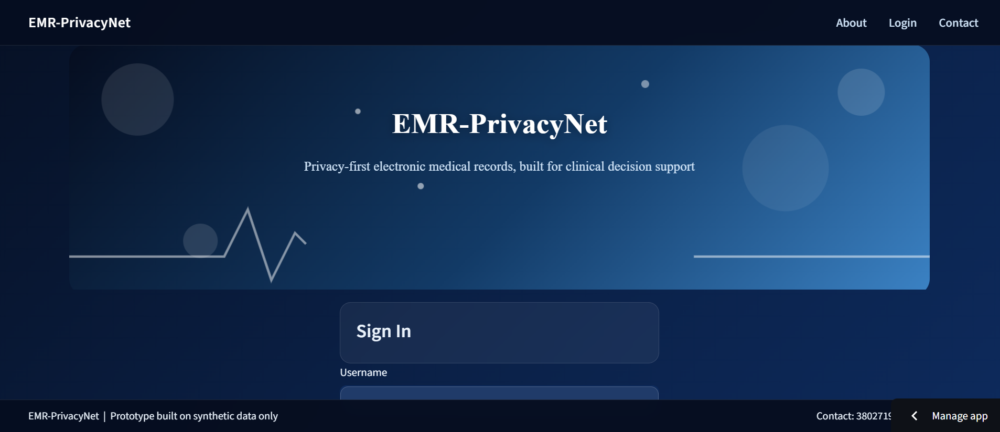
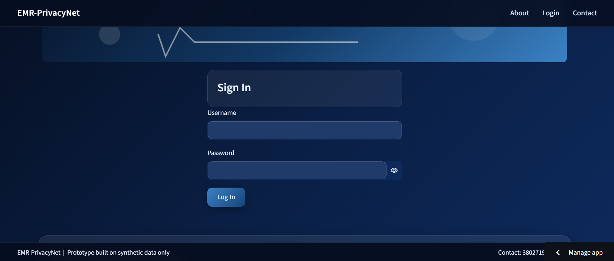
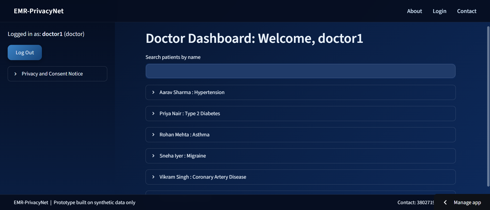
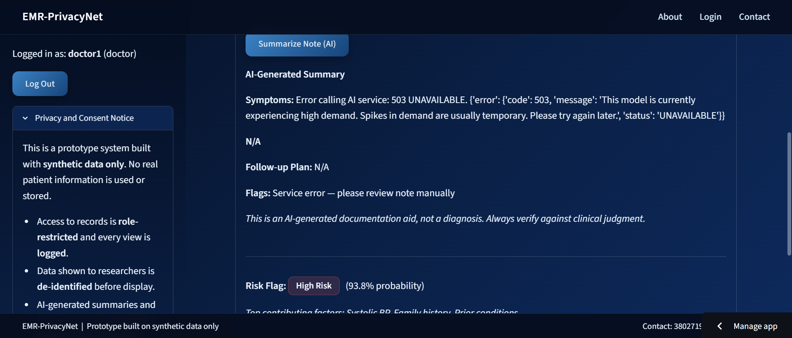
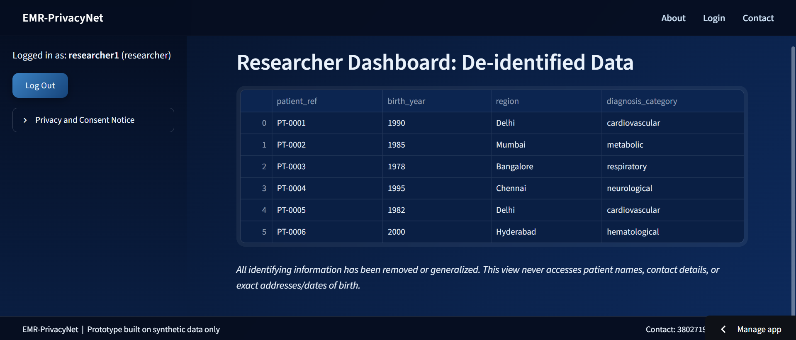

# EMR-PrivacyNet

A prototype Electronic Medical Records (EMR) system demonstrating role-based access control, patient data de-identification, audit logging, and AI-assisted clinical decision support, built entirely on synthetic data.

Built as a self-directed project to explore the intersection of healthcare informatics, data privacy, and applied AI, the same themes central to EMR integration and clinical decision support work.

**Live demo:** [add your Streamlit Cloud link here]
**Repository:** [add your GitHub repo link here]

---

## Demo Access

| Role | Username | Password |
|---|---|---|
| Doctor | `doctor1` | `testpass123` |
| Receptionist | `reception1` | `testpass123` |
| Researcher | `researcher1` | `testpass123` |
| Admin | `admin1` | `testpass123` |

All accounts use synthetic test data only.

---

## Skills Demonstrated


| Skill from posting | How it's demonstrated here |
|---|---|
| **Python** | Entire codebase: backend logic, database layer, ML pipeline, app framework |
| **AI/ML** | Logistic regression risk-flagging model: feature engineering, scaling, class balancing, cross-validation, evaluation (accuracy, precision, recall, confusion matrix), and per-patient explainability via model coefficients |
| **NLP** | LLM-based structured extraction from unstructured clinical text (the visit note summarizer), which is an NLP task: parsing free-text notes into symptoms, probable diagnosis, follow-up plan, and flags |
| **Gen AI & LLM** | Google Gemini API integration, including prompt design with few-shot examples, strict structured (JSON) output, and graceful error handling for malformed or failed responses |
| **Web/app development** | Full Streamlit application: multi-role authentication, session management, role-based dashboards, custom theming, and a public deployment on Streamlit Community Cloud |
| **Databases** | SQLite schema design across four related tables (users, patients, appointments, audit_log), parameterized queries, and role-scoped query design for access control |
| **Documentation** | This README, inline code comments, and a build plan followed across the project's development |
| **Healthcare informatics interest** | The project's entire premise: de-identification following k-anonymity principles, audit logging aligned with clinical data governance norms, and explicit framing of AI outputs as documentation aids rather than diagnoses |


---

## What It Does

| Role | Access |
|---|---|
| **Doctor** | Full patient records, AI-generated visit note summaries, ML-based risk flags with explanations |
| **Receptionist** | Name and contact info only, no clinical data at any point, including at the database query level |
| **Researcher** | De-identified, generalized data only (no names, contacts, exact dates, or addresses) |
| **Admin** | Audit log of every record access across all roles |

---

## Screenshots











---

## Tech Stack

- **Python** — core language
- **Streamlit** — web app framework and deployment
- **SQLite** — database
- **scikit-learn** — risk-flagging ML model (logistic regression, with scaling and class balancing)
- **Google Gemini API** — LLM-based NLP for clinical note summarization (structured extraction from unstructured text)
- **hashlib (PBKDF2-HMAC-SHA256)** — password hashing

---

## How to Run Locally

```bash
git clone <your-repo-url>
cd EMR-PrivacyNet
python -m venv venv
venv\Scripts\activate          # Windows
# source venv/bin/activate     # Mac/Linux

pip install -r requirements.txt
```

Create a `.env` file in the project root:
```
GOOGLE_API_KEY=your_key_here
```

Then run:
```bash
streamlit run app.py
```

The app automatically initializes the database and seeds demo users/patients on first run if none exist, no manual setup scripts required.

---

## Design Rationale

### Role-based access control
Each role's database query is scoped to only the columns it is permitted to see. For example, the receptionist query (`SELECT id, name, contact`) never fetches diagnosis or medication fields at all. This is a deliberate choice: privacy enforcement happens at the data-access layer, not just hidden in the UI, so there is no path by which a receptionist-facing view could accidentally leak clinical data.

### De-identification (researcher view)
Researcher-facing data is transformed before display:
- Name and contact dropped entirely, replaced with a synthetic reference ID (`PT-0001`)
- Date of birth generalized to birth year only
- Address generalized to city/region
- Diagnosis generalized to a broader clinical category (e.g. "cardiovascular" instead of a specific condition)

This follows basic k-anonymity principles: generalizing quasi-identifiers so individual records are less uniquely identifiable, while preserving enough structure for population-level research.

### Audit logging
Every record access, across every role, is logged with a timestamp, username, role, and action, visible only to the admin role. This extends to AI-assisted actions specifically (e.g. "AI-summarized note for patient X" is logged as a distinct, traceable action), not just basic record views.

### AI integration is scoped to match existing access boundaries
The LLM summarizer and risk model are only available to the doctor role, the same role with access to raw clinical notes and structured vitals. This was a deliberate design choice: AI features were built inside the existing access-control model rather than added as a separate layer that could bypass it.

---

## AI Feature 1: LLM Clinical Note Summarizer (NLP + Gen AI)

Doctors can click "Summarize Note" on any patient to convert a free-text visit note into structured fields: symptoms, an AI-suggested (explicitly labeled as non-diagnostic) probable diagnosis, a follow-up plan, and any flagged concerns. This is an NLP task, extracting structured meaning from unstructured text, implemented using a large language model rather than a traditional NLP pipeline.

**Design choices:**
- Prompt uses a few-shot example to keep JSON output format consistent
- Output is explicitly labeled "AI-suggested (not a diagnosis)" in the prompt itself, not just the UI, a deliberate safety choice baked into the model's output rather than a cosmetic label
- Graceful error handling: if the API call fails or returns malformed JSON, the UI shows a safe fallback message instead of crashing

**Known limitation:** performance on genuinely ambiguous or very short notes is inconsistent, tested informally against a handful of synthetic notes rather than systematically evaluated. This is appropriate for a documentation aid, not a limitation that would be acceptable for an actual diagnostic tool.

---

## AI Feature 2: Risk-Flagging Model (AI/ML)

A logistic regression model trained on a synthetic dataset of 1,500 records (age, blood pressure, BMI, smoking status, family history, prior conditions) flags patients as High or Low Risk, with a probability score and the top contributing factors shown for high-risk flags.

**Synthetic data generation:** features were generated with deliberately correlated relationships (higher age, elevated BP, smoking, and more prior conditions increase risk), plus random noise so the dataset is not perfectly separable. This does not reflect real clinical risk formulas; it is illustrative, built to give the model a genuine (if simplified) pattern to learn. This training dataset exists only to fit the model and is separate from the small set of demo patients shown in the app itself.

**Model choices:**
- Logistic regression chosen specifically for interpretability, coefficients directly explain each prediction, which matters in a clinical decision-support context where "why was this patient flagged" needs an answer
- `class_weight="balanced"` used deliberately to prioritize recall over raw accuracy, since in this context, missing a genuinely high-risk patient (a false negative) is more costly than an unnecessary review (a false positive)
- Features were scaled (StandardScaler) before training, since logistic regression is sensitive to features on different numeric scales

**Evaluation (5-fold cross-validation, 1,500 synthetic records, ~30% high-risk):**
- Accuracy: 0.819
- Precision: 0.657
- Recall: 0.821 (mean CV recall: 0.827, range 0.744-0.933)

The precision/recall trade-off here is intentional, not a weakness to be optimized away. It reflects a deliberate design decision about which type of error matters more in this context.

---

## Security Notes

- Passwords are never stored in plaintext, salted and hashed using PBKDF2-HMAC-SHA256 with 100,000 iterations
- Each user has a unique, randomly generated salt
- API keys are stored via environment variables locally and Streamlit's secrets manager when deployed, never committed to version control

---

## All Data Is Synthetic

Every patient record, visit note, and training data point in this project is fabricated for demonstration purposes. No real patient information, real clinical data, or real individuals are represented anywhere in this codebase.

---

## Limitations & What a Production System Would Need

This is a prototype, not a production-ready system, built deliberately with this gap in mind:
- Session management is Streamlit's built-in session state, not a production-grade auth system (no token expiry, refresh, or multi-device handling)
- No encryption at rest for the SQLite database
- The risk model has not been clinically validated; it demonstrates the ML pipeline (data, model, evaluation, explanation), not a clinically meaningful tool
- No compliance review against frameworks like HIPAA or India's Digital Personal Data Protection (DPDP) Act, both of which would be mandatory before handling real patient data
- The deployed app's filesystem is ephemeral; any data added during a live session resets on redeploy, which is acceptable for a demo but would need a persistent, production-grade database otherwise
- Does not involve any hardware or software-hardware interaction

---

## Future Work

- A dedicated NLP classifier for symptom-to-specialist routing, as a complementary approach to the LLM-based summarizer already in place
- Trend summarization for the researcher role, built on the existing de-identified `diagnosis_category` data
- Appointment scheduling for the receptionist role
- Formal clinical validation of the risk model against real, properly licensed, IRB-approved datasets before any real-world consideration